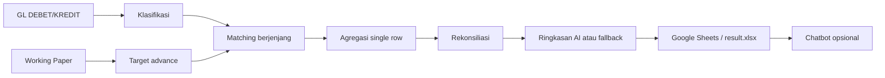
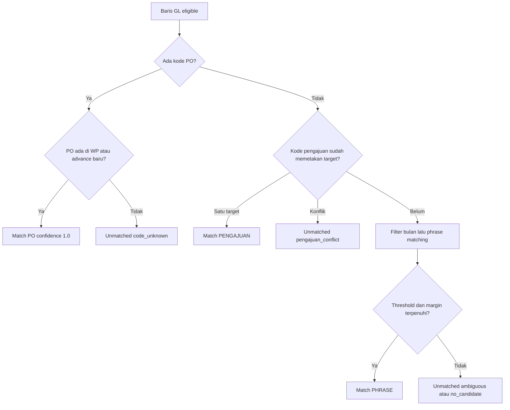

# SouthCity Advance Settlement Automation

Proyek ini mengotomatisasi rekonsiliasi uang muka dan settlement pada akun
`Advances - Other`. Pipeline membaca General Ledger (GL) dan Working Paper
(WP), mengklasifikasikan transaksi, mencocokkan kredit ke target advance,
menghitung saldo, lalu menyusun laporan Excel atau Google Sheets. Ringkasan
eksekutif dapat dibuat oleh Gemini, tetapi seluruh angka resmi dihitung oleh
Python. Antarmuka chatbot Gradio bersifat opsional dan membaca snapshot hasil
pipeline.



## 1. Panduan Instalasi dan Pengujian

### Prasyarat

- Python 3.10 atau lebih baru. Dependensi yang dipatok tercantum di
  [`requirements.txt`]
- Akun Google Cloud dengan Google Sheets API dan Google Drive API aktif.
- Gemini API key hanya diperlukan untuk ringkasan AI; pipeline dapat memakai
  fallback deterministik dengan `--no-ai` atau `--dry-run`.
- Spreadsheet tujuan dan service account Google dengan hak Editor untuk ekspor.

### Setup

```text
git clone https://github.com/FarhanNurrohman/technical-take-home-test-junior-ai-automation-engineer.git
cd <folder-proyek>
```

Windows PowerShell:

```powershell
py -3 -m venv .venv
.\.venv\Scripts\Activate.ps1
python -m pip install -r requirements.txt
```

Linux/macOS:

```bash
python3 -m venv .venv
source .venv/bin/activate
python -m pip install -r requirements.txt
```

### Konfigurasi

Salin `.env.example` menjadi `.env`, lalu isi hanya nilai yang dipakai. Jangan
commit `.env` atau file credentials.

| Variabel | Wajib | Fungsi | Contoh fiktif |
|---|---:|---|---|
| `GEMINI_API_KEY` | untuk AI | API key Gemini | `8912jnunr3nfinionqondoq` |
| `GEMINI_MODEL` | untuk AI | Nama model `generateContent` | `gemini-model-terkini` |
| `GOOGLE_SHEETS_CRED` | untuk Sheets | Path JSON service account | `credentials.json` |
| `GOOGLE_SHEETS_CRED_READONLY` | opsional | Kredensial baca chatbot; default mengikuti kredensial utama | `credentials-readonly.json` |
| `SPREADSHEET_KEY` | untuk Sheets/chatbot | ID spreadsheet pada URL `/d/1Vggthn-mWIXDeAQlnd_HBBPfXIfTMDCHNWrHisjld8o/edit` | `spreadsheet-id-fiktif` |
| `WORKING_PAPER_SHEET_KEY` | opsional | Slot konfigurasi untuk sumber WP terpisah | `wp-spreadsheet-id-fiktif` |
| `SHARE_PUBLIC` | opsional | Mengaktifkan berbagi publik bila ekspor mendukungnya | `false` |
| `ADJUSTMENT_MODE` | opsional | `net` mengurangkan debit koreksi; `ignore` mengabaikannya | `net` |
| `CHAT_AUTH_USER` | opsional | Username autentikasi chatbot lokal | `finance-user` |
| `CHAT_AUTH_PASS` | opsional | Password autentikasi chatbot lokal | `ubah-di-lokal` |
| `CHAT_TIMEOUT_SECONDS` | opsional | Timeout konfigurasi chatbot | `30` |
| `DATA_CACHE_TTL_SECONDS` | opsional | TTL cache data chatbot | `300` |
| `MAX_AGENT_STEPS` | opsional | Batas langkah agent chatbot | `4` |
| `CHAT_RATE_LIMIT_PER_MIN` | opsional | Batas pertanyaan per sesi per menit | `10` |

Kode memberi default untuk semua variabel opsional di atas. Hapus baris
opsional yang tidak dipakai; jangan meninggalkan nilai kosong secara tidak
sengaja. `ADJUSTMENT_MODE` hanya menerima `net` atau `ignore`. Konfigurasi
penyembunyian sheet mesin belum tersedia di kode saat ini; tiga sheet hasil
yang dibuat pipeline tetap terlihat oleh pemilik spreadsheet.

Untuk menjalankan pipeline sampai ekspor Google Sheets, konfigurasi minimal
full-run adalah `GEMINI_API_KEY`, `GEMINI_MODEL`, `GOOGLE_SHEETS_CRED`, dan
`SPREADSHEET_KEY`. Jika hanya ingin menjalankan lokal tanpa AI/Sheets,
`GEMINI_*` dan `SPREADSHEET_KEY` dapat dikosongkan.

### Google Cloud dan Google Sheets

1. Buat service account di Google Cloud.
2. Aktifkan **Google Sheets API** dan **Google Drive API**.
3. Unduh JSON service-account, simpan lokal sebagai `credentials.json` di
   root proyek, dan isi `GOOGLE_SHEETS_CRED=credentials.json`.
4. Cari `client_email` di JSON tersebut.
5. Buat atau buka spreadsheet tujuan, lalu bagikan kepada `client_email`
   sebagai **Editor**.
6. Isi `SPREADSHEET_KEY` dengan bagian ID dari URL
   `https://docs.google.com/spreadsheets/d/<ID>/edit`.

Ekspor memakai formula yang divalidasi agar tidak bergantung pada pemisah
locale spreadsheet. Locale spreadsheet karena itu bebas, selama izin dan API
telah benar.

### Gemini

Isi `GEMINI_MODEL` dengan model yang tersedia dan mendukung `generateContent`.
Nama model dapat berubah atau dihentikan. Daftar model yang mendukung operasi
tersebut dapat diperiksa dengan:

```text
python scripts/list_models.py
```

Skrip tersebut membaca konfigurasi lokal dan hanya menampilkan nama model,
bukan API key. Jika konfigurasi tidak ada, model mengembalikan 404, respons
diblokir, kosong, atau request gagal, pipeline memakai ringkasan deterministik
setelah retry terbatas. Angka tidak diserahkan kepada Gemini untuk dihitung.

### Menjalankan pipeline

```text
python main.py --help
python main.py --dry-run
python main.py --no-ai
python main.py
```

`--dry-run` menulis `output/result.xlsx` tanpa Gemini atau Google Sheets dan
juga menyimpan artefak JSON untuk chatbot. `--no-ai` memakai ringkasan
deterministik; tanpa flag tersebut, `main.py` mengekspor ke Google Sheets.
Output Google Sheets saat ini terdiri dari tiga sheet:

- `Working_Paper_Result`: WP awal dan advance baru April, realisasi single row,
  saldo formula, status, dan flag.
- `Dashboard`: ringkasan eksekutif, KPI, item yang masih bersaldo, dan status
  rekonsiliasi.
- `Unmatched_GL`: kredit atau koreksi yang belum match, alasan, pengecualian
  debit, serta saran kandidat manual.

Chatbot lokal opsional:

```text
python app.py --demo
python app.py --demo --check
python app.py
```

`--demo` memakai data sintetis. `--check` hanya memvalidasi payload dan tidak
menjalankan server. Jangan mengaktifkan `share=True`; implementasi saat ini
mengikat server ke `127.0.0.1` dan memakai `share=False`.

### Data input

Berkas keuangan perusahaan tidak dimaksudkan untuk dipublikasikan. Letakkan
secara lokal di:

- `data/GL - Advances Other - April 2026.xls`
- `data/Working Paper Advances and Prepayment-Soal.xlsx`

Nama dan lokasi tersebut berasal dari [`src/config.py`]
Folder `data/` diabaikan oleh Git. Jangan menyalin isi data transaksi ke issue,
README, atau log publik.

### Pengujian

```text
pytest -q
pytest -q --cov=src
```

Test unit menggunakan data sintetis dan mock sehingga tidak memerlukan
jaringan. Test yang membutuhkan workbook asli atau label manual dilewati
otomatis bila berkas lokal tidak tersedia. Jika memiliki data dan label yang
berwenang, jalankan test suite yang sama dari checkout lokal; jangan commit
workbook atau golden data rahasia.

Ringkasan cakupan test berdasarkan nama berkas:

- `test_step1_loaders.py`: parsing amount, tanggal, header dinamis, dan
  integritas saldo GL.
- `test_matcher.py`: klasifikasi match, multi-voucher, status, saldo, dan
  rekonsiliasi.
- `test_scoring.py`: normalisasi, scorer, threshold, dan veto unit.
- `test_exporter.py`: payload, formula, freeze, merge, dan validasi ekspor.
- `test_ai_summary.py`: metrik, fallback, validasi narasi, dan payload Gemini.
- `test_chat_assistant.py`: tool chatbot, guardrail, dan jawaban deterministik.
- `test_sheets_chat_loader.py`: parsing snapshot Google Sheets dengan mock.
- `test_artifacts.py`: serialisasi artefak JSON dan validasi schema.
- `test_e2e.py`: alur pipeline terisolasi.
- `test_app.py`: demo dan handler chatbot.
- `test_profile_data.py` dan `test_tune_matching.py`: utilitas profiling/tuning.
- `test_scaffold.py` dan `test_agent_architecture.py`: struktur proyek serta
  aturan agent.
- `test_golden.py`: label manual; otomatis skip jika fixture tidak dipublikasikan.
- `test_readme.py`: kontrak dokumentasi, path, environment, secret, dan Mermaid.

Pada penulisan README ini, suite dijalankan ulang setelah file dokumentasi
selesai. Hasil aktual dan cakupan dicantumkan pada laporan akhir pekerjaan,
bukan diperkirakan di muka.

### Pemecahan masalah

- **403**: bagikan spreadsheet kepada `client_email` service account sebagai
  Editor dan pastikan Drive API aktif.
- **API tidak aktif**: aktifkan Google Sheets API dan Google Drive API pada
  project Cloud yang benar.
- **404 model Gemini**: periksa nama model dengan `scripts/list_models.py` dan
  Google AI Studio.
- **429**: periksa kuota, retry, dan batas request; gunakan `--no-ai` sementara.
- **`#ERROR!` formula**: periksa formula/locale dan gunakan formula yang
  diekspor aplikasi, bukan mengedit pemisahnya secara manual.
- **Error freeze/merge**: implementasi hanya membekukan baris dan memvalidasi
  merge sebelum request dikirim; periksa struktur payload bila membuat
  perubahan exporter.

## 2. Logika Algoritma Matching

### Konsep bisnis

Advance adalah DEBET dan menjadi target yang harus dipantau. Settlement atau
pengembalian adalah KREDIT. Saldo target dihitung sebagai `Amount -
Realization`. Debit bertanda pengembalian diklasifikasikan sebagai koreksi,
bukan advance baru.

### Klasifikasi GL

Klasifikasi dilakukan berdasarkan kolom nominal lebih dahulu, kemudian teks
deskripsi:

| Kondisi | `txn_type` |
|---|---|
| KREDIT positif tanpa kata pengembalian | `SETTLEMENT` |
| KREDIT positif dengan kata pengembalian | `REFUND` |
| DEBET positif dengan kata pengembalian | `ADJUSTMENT` |
| DEBET positif dengan voucher `ADV/` atau PO yang belum ada di WP | `NEW_ADVANCE` |
| DEBET positif lainnya | `UNCLASSIFIED_DEBIT` |

`ADJUSTMENT` tidak pernah dibuat menjadi baris advance baru. `UNCLASSIFIED_DEBIT`
dicatat sebagai pengecualian untuk diperiksa.

### Ekstraksi kode

Kode PO/WO/SPK/PGJ diekstrak dengan pola yang tersimpan di konfigurasi:

```text
\b[A-Z0-9]{2,}/(?:PO|WO|SPK|PGJ)/\d+\b
```

Kode pengajuan memakai angka Romawi untuk bulan:

```text
\b[A-Z][A-Z0-9-]*/(?:XII|XI|X|IX|VIII|VII|VI|V|IV|III|II|I)/\d{2,4}\b
```

Semua kode dikembalikan uppercase. Segmen `BK`, `BM`, dan `HO` bukan angka
Romawi sehingga tidak dianggap bulan pengajuan. Nomor jurnal juga tidak boleh
dipakai sebagai kode pengajuan hanya karena memiliki slash.

### Urutan matching



Urutannya adalah:

1. PO yang ada di WP langsung dipetakan ke baris WP.
2. PO yang tidak ada di WP tetapi ada pada `NEW_ADVANCE` dipetakan ke target
   advance baru.
3. Kode pengajuan yang sama dipropagasikan ke target yang sudah diketahui;
   konflik menghasilkan `pengajuan_conflict`.
4. Hanya deskripsi tanpa PO yang masuk phrase matching.
5. Tidak ada kandidat menghasilkan `no_candidate` atau `month_mismatch`;
   skor rendah atau kandidat tidak unik menghasilkan `ambiguous`.

Baris GL tidak boleh dipakai dua kali. Prinsipnya adalah lebih baik
`unmatched` daripada salah match, terutama untuk kode yang tidak dikenal atau
kandidat yang ambigu.

### Similarity dan filter

`src/scoring.py` menyediakan token Jaccard, RapidFuzz token-set, RapidFuzz
partial, TF-IDF cosine sederhana, dan scorer gabungan. Scorer aktif di
pipeline matching adalah `token_jaccard`; nilai threshold berasal dari
`SIMILARITY_THRESHOLD` dan default-nya `0.6`. Kandidat terbaik juga harus
unggul minimal `0.1` dari kandidat kedua. Angka unit dipertahankan saat
normalisasi dan perbedaan unit dapat memveto skor; misalnya deskripsi fiktif
`Furniture Unit 1127` tidak boleh tertukar dengan `Furniture Unit 1132`.
Filter bulan kode pengajuan diterapkan sebelum penilaian frasa.

### Single Row dan status

Semua voucher yang match ke satu target digabung dalam satu baris. Tanggal
realisasi adalah tanggal settlement/refund terbaru, voucher unik diurutkan
menurut tanggal, dan debit koreksi diberi penanda `(koreksi)`. Realisasi:

```text
SUM(KREDIT) - SUM(DEBET ADJUSTMENT)
```

Dengan `ADJUSTMENT_MODE=ignore`, debit koreksi tidak dikurangkan. Kolom H pada
output adalah formula `= Amount - G`, bukan angka statis.

Status memakai toleransi `0.01`:

- `SETTLED`: saldo mendekati nol.
- `PARTIAL`: realisasi positif tetapi masih ada saldo.
- `UNSETTLED`: belum ada realisasi.
- `OVER_SETTLED`: saldo negatif.

Jika semua realisasi target adalah refund, flag
`need_settlement_evidence` meminta bukti belanja; refund saja tidak dianggap
sebagai settlement belanja.

### Rekonsiliasi dan integritas

`reconcile()` memeriksa:

```text
total KREDIT GL = kredit ter-match + kredit tak-ter-match
```

Selisih di atas `0.01` menghasilkan error. Pemeriksaan saldo berjalan GL
mengikuti urutan baris file, memakai `saldo_sebelumnya + debet - kredit =
saldo`; ketidakkonsistenan dilaporkan sebagai exception, bukan diurutkan ulang
berdasarkan tanggal. Baris kosong dan subtotal yang dibuang loader dihitung
dan dicatat log.

Advance baru dikumpulkan dari DEBET `NEW_ADVANCE` dan dilaporkan terpisah di
bawah WP awal, dengan subtotal sendiri. `suggest_settlement_candidates`
menghasilkan saran manual untuk item partial/unsettled tertentu; saran tersebut
bukan match otomatis.

### Peran AI di pipeline

Python menghitung semua total, status, saldo, dan rekonsiliasi. Gemini hanya
mengubah subset metrik terformat menjadi narasi berbahasa Indonesia. Payload
dibatasi pada metrik dan maksimal sejumlah item unsettled, lalu respons
divalidasi terhadap angka yang diizinkan. Jika respons kosong, diblokir,
mengandung angka asing, konfigurasi gagal, atau request gagal, fallback
deterministik digunakan. Pertanyaan chatbot yang meminta data mentah,
nomor jurnal, kredensial, atau API key diblokir oleh guardrail.

## 3. Pemanfaatan AI Coding Assistant

### Alat dan pola kerja

Pengembangan menggunakan GitHub Copilot paket Free dalam agent mode dengan
model Auto sebagai pair programmer, serta asisten AI lain di chat untuk
merancang spesifikasi, prompt, dan meninjau hasil. Batasan dalam pengembangan dengan copilot
dan AI chat lain kali ini adalahadalah kuota kredit paket Free, model tidak dipilih manual pada paket tersebut, dan nama model Gemini perlu diperbarui bila model lama dihentikan.

Sumber kebenaran teknis adalah [`docs/SPEC.md`]
Aturan global ada di [`.github/copilot-instructions.md`]
aturan Python dan test ada di folder `.github/instructions/`, sedangkan agent
kustom tersedia di `.github/agents/`.

Tahap prompt yang tersedia:

| Tahap | Prompt | Tujuan |
|---|---|---|
| 0 | `.github/prompts/s0-setup.prompt.md` | scaffold dan aturan awal |
| 1 | `.github/prompts/s1-loaders.prompt.md` | loader workbook |
| 1b | `.github/prompts/s1b-profile.prompt.md` | profiling data |
| 2 | `.github/prompts/s2-matcher.prompt.md` | matching |
| 2b | `.github/prompts/s2b-golden.prompt.md` | label golden |
| 2e | `.github/prompts/s2e-tune.prompt.md` | tuning scorer |
| 3 | `.github/prompts/s3-ai.prompt.md` | ringkasan Gemini |
| 4 | `.github/prompts/s4-sheets.prompt.md` | ekspor Sheets |
| 5 | `.github/prompts/s5-final.prompt.md` | finalisasi pipeline |
| 6 | `.github/prompts/s6-chat.prompt.md` | chatbot |
| 7 | `.github/prompts/s7-readme.prompt.md` | README |

Setiap tahap memakai gerbang test-first dan menunggu `pytest` hijau sebelum
lanjut. Aturan juga melarang membuka atau commit `.env`, credentials, dan data
keuangan. Pemanggilan layanan nyata perlu konfigurasi eksplisit; test memakai
mock dan tidak memakai jaringan.

### Peran manusia dan mitigasi risiko

Manusia tetap memeriksa layout file asli sebelum coding, memvalidasi hasil
matching secara manual, memberi label training untuk model nlp matching text dangan metode Similarity dan filter, dan memutuskan desain seperti Single Row serta perlakuan debit koreksi. Risiko halusinasi angka dikurangi
dengan metrik Python dan validasi respons. Prompt injection dari teks transaksi
dibatasi dengan payload terstruktur, automatic function calling dinonaktifkan
untuk ringkasan, dan guardrail pertanyaan/respons.

spesifikasi dan test sintetis membuat perubahan lebih dapat diaudit, tetapi hasil matching tetap harus ditinjau ketika pola deskripsi atau layout sumber berubah. Threshold `0.6` dan margin `0.1` adalah parameter awal, bukan klaim akurasi universal.

## 4. Keluaran Deliverable

| Deliverable | Tautan |
|---|---|
| Google Sheets `Working_Paper_Result` | `https://docs.google.com/spreadsheets/d/1Vggthn-mWIXDeAQlnd_HBBPfXIfTMDCHNWrHisjld8o/edit?gid=1571479220#gid=1571479220` |
| Google Sheets `Dashboard` | `https://docs.google.com/spreadsheets/d/1Vggthn-mWIXDeAQlnd_HBBPfXIfTMDCHNWrHisjld8o/edit?gid=479666508#gid=479666508` |
| Google Sheets `Unmatched_GL` | `https://docs.google.com/spreadsheets/d/1Vggthn-mWIXDeAQlnd_HBBPfXIfTMDCHNWrHisjld8o/edit?gid=1857267549#gid=1857267549` |
| Repository GitHub | `https://github.com/FarhanNurrohman/technical-take-home-test-junior-ai-automation-engineer.git` |

Spreadsheet publik dapat menampilkan semua sheet yang dibuat, termasuk data
audit. Karena pengaturan penyembunyian sheet mesin belum tersedia, jangan
membagikan spreadsheet berisi informasi yang tidak boleh terlihat publik.

## 5. Asumsi dan Keterbatasan

| Asumsi | Status |
|---|---|
| Angka Romawi pada kode pengajuan merepresentasikan bulan pengajuan dan kira-kira sejalan dengan tanggal advance. | Dugaan domain; perlu konfirmasi Finance. |
| Debit bertanda pengembalian adalah koreksi pembalik realisasi, bukan advance baru. | Belum terkonfirmasi; default kode `ADJUSTMENT_MODE=net`. |
| Settlement belanja dapat tercatat di luar periode GL yang sedang diproses. | Keterbatasan periode; perlu rekonsiliasi lintas periode. |
| Arti prefix `BK`, `BM`, `ADV`, dan prefix voucher lain disimpulkan dari pola. | Dugaan; jangan dipakai sebagai definisi akuntansi tanpa konfirmasi. |
| Threshold `0.6`, margin `0.1`, bobot scorer, dan veto unit adalah parameter awal. | Perlu tuning pada data berizin; bukan klaim akurasi. |
| Item prepayment tanpa jadwal amortisasi WP dilaporkan sesuai kredit yang tersedia. | Asumsi pelaporan. |
| Data di `data/` tidak boleh masuk repository publik tanpa persetujuan. | Aturan privasi dan `.gitignore`. |
| Dataset test yang dipublikasikan bersifat sintetis/kecil. | Batas validasi; tidak mewakili performa produksi. |

Kode saat ini juga berbeda dari beberapa uraian legacy: layout WP dideteksi
dinamis, exporter membuat tiga sheet, scorer pipeline adalah token Jaccard,
dan konfigurasi penyembunyian sheet mesin belum ada. Perbedaan ini sengaja
ditulis terbuka agar pembaca tidak menganggap fitur yang belum diimplementasi
sebagai jaminan.

## 6. Struktur Repo dan Lisensi

```text
.
├── .env.example
├── .github/
│   ├── agents/
│   ├── instructions/
│   └── prompts/
├── docs/
│   └── SPEC.md
├── scripts/
│   ├── inspect_files.py
│   ├── list_models.py
│   ├── profile_data.py
│   └── tune_matching.py
├── src/
│   ├── config.py
│   ├── loaders.py
│   ├── matcher.py
│   ├── parsing.py
│   ├── scoring.py
│   ├── ai_summary.py
│   ├── sheets_exporter.py
│   ├── chat_assistant.py
│   ├── guardrails.py
│   ├── artifacts.py
│   └── sheets_chat_loader.py
├── tests/
├── app.py
├── main.py
├── README.md
└── requirements.txt
```

Tidak ada berkas lisensi yang ditambahkan atau terdeteksi dalam cakupan
proyek ini. Tambahkan lisensi terpisah bila deliverable publik memerlukannya.
